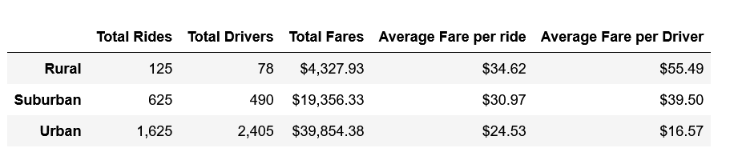
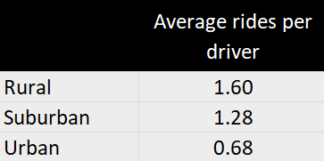

# PyBer_Analysis
Data Analytics Boot Camp - Module 5

## Overview of the Analysis

The main objective of this analysis is to view and compare ***PyBer’s*** ride-sharing data for a long list of cities and derive recommendations for ***PyBer’s*** decision-makers that will help improve the business.

The ride-sharing data includes city name, city types, number of drivers per city, ride dates, fares, and IDs. We will group the data by city type and study at the different metrics *(ex. Average fare per ride and average fare per driver)*.

A line chart will be provided to help better visualize the data.

## Results

Looking at ***ByPer’s*** summary by city type, we notice the huge difference in the number of rides and drivers between the three different types. The lower number of rides is the higher the average fair per ride and/or driver. This can be viewed in the below table:

Rural cities have a higher number of rides per driver compared to the other two city types as we can see below:

 
When plotting the total fare by city type and viewing this data by week for the *first 4 months of 2019*, we notice a spike in fare totals towards the end of *February* for all three city types. This could be due to weather improving and people starting to get out more. Another thing to look at is the total revenue per city type; higher revenue in urban cities is caused by higher population thus higher number of drivers but at lower rates (economy of scale).

 
## Summary

Based on the above findings, the below business recommendations to the CEO will help addressing any disparities among the city types and hopefully improve revenue:
1.	Increase number of drivers in rural and suburban cities which should translate to improved revenue
2.	Decrease average fares in rural and suburban cities
3.	Decrease number of drivers and increase fares in urban cities

---

